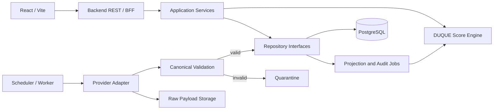

# DUQUE Score Backend - Architecture v1

## Objetivo

Definir a fronteira segura entre o aplicativo React, os provedores esportivos, o Engine e a persistencia. Este documento e uma proposta de arquitetura e nao autoriza integracao externa.

## Principios

- O React nunca acessa provedores esportivos ou bancos diretamente.
- Credenciais nunca usam prefixo `VITE_` nem entram no bundle do navegador.
- Payload externo e convertido antes de entrar no dominio canonico.
- Snapshots, projecoes e auditorias sao imutaveis.
- Toda execucao relevante possui identidade idempotente e versao.
- Dados ausentes permanecem `null`.
- Falhas de validacao seguem para quarentena, nao para o Engine.
- Componentes assincronos so serao adicionados quando houver carga ou confiabilidade que os justifique.

## Componentes

## Camadas

| Camada | Responsabilidade |
| --- | --- |
| API | HTTP, autenticacao, rate limit, validacao superficial e envelopes |
| Application | Casos de uso, transacoes, idempotencia e autorizacao |
| Domain | Contratos canonicos, Engine, liquidacao, auditoria e calibracao |
| Adapters | Conversao de fornecedores para o dominio |
| Infrastructure | PostgreSQL, cache, filas, objetos e observabilidade |

Dependencias apontam para dentro: dominio nao conhece HTTP, PostgreSQL ou fornecedor.

## Processos

### Ingestao

1. Scheduler solicita um lote ao provedor.
2. Payload bruto recebe checksum, horario e politica de retencao.
3. Adaptador converte o lote para contratos canonicos.
4. Validadores aprovam ou enviam registros para quarentena.
5. Identidades sao atualizadas de forma idempotente.
6. Snapshots e eventos sao anexados sem sobrescrever historico.
7. Uma execucao de ingestao registra totais, falhas e latencia.

### Projecao

1. Partida elegivel solicita um snapshot de entrada congelado.
2. Data Quality decide se a execucao pode continuar.
3. Engine produz uma projecao canonica ou um bloqueio.
4. A saida e persistida com versoes de codigo, features e modelos.
5. A API publica apenas execucoes concluidas e autorizadas para leitura.

### Auditoria

1. Resultado final validado encerra a partida.
2. Projecoes concluidas sao liquidadas uma unica vez por regra e resultado.
3. Auditorias e metricas sao anexadas ao historico.
4. Backtesting e calibracao usam artefatos congelados, nunca tabelas mutaveis ao vivo.

## Seguranca

- Segredos ficam apenas no ambiente do backend.
- CORS permite somente origens aprovadas.
- Endpoints internos exigem identidade de servico.
- Endpoints publicos possuem rate limit e limites de pagina.
- Logs removem tokens, payloads pessoais e cabecalhos sensiveis.
- Leads e dados pessoais ficam separados do dominio esportivo.
- Nenhuma resposta publica inclui payload bruto do fornecedor.

## Operacao inicial

O primeiro backend deve iniciar como um unico servico modular, com worker no mesmo repositorio e processos separados quando necessario. Microservicos nao sao recomendados antes de existir escala, ownership ou isolamento operacional que justifique a complexidade.

O recorte inicial usa Node.js com `node:http` e repositorio em memoria. Essa decisao evita dependencia prematura, mas deve ser reavaliada antes de rotas de escrita, autenticacao ou middleware operacional complexo.

## Decisoes pendentes

- Provedor esportivo e termos de licenca.
- Servico gerenciado de PostgreSQL.
- Armazenamento de objetos e politica de retencao.
- Plataforma de jobs e cache.
- Regioes, SLA e orcamento operacional.
- Framework HTTP para a etapa posterior ao recorte somente leitura.
