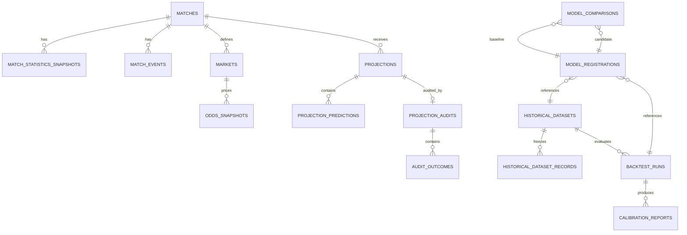

# DUQUE Score Backend - Persistence Model v1

## Banco recomendado

PostgreSQL e a proposta para o nucleo canonico por oferecer transacoes, integridade referencial, indices, JSON controlado e maturidade operacional. A escolha do fornecedor gerenciado permanece pendente.

Payloads brutos grandes devem ficar em armazenamento de objetos. O banco guarda ponteiro, checksum, origem, horario e politica de retencao.

## Dominios relacionais

### Identidade esportiva

- `sources`
- `competitions`
- `seasons`
- `teams`
- `matches`
- `external_identifiers`

### Historico da partida

- `match_statistics_snapshots`
- `match_events`
- `match_results`
- `markets`
- `odds_snapshots`
- `odds_selections`

### Engine

- `input_snapshots`
- `feature_snapshots`
- `projections`
- `projection_predictions`
- `projection_evidence`
- `projection_audits`
- `audit_outcomes`

### Validacao cientifica

- `historical_datasets`
- `historical_dataset_records`
- `backtest_runs`
- `backtest_cases`
- `calibration_reports`
- `model_registrations`
- `model_comparisons`

### Operacao

- `ingestion_runs`
- `provider_payload_references`
- `quarantine_records`
- `idempotency_keys`
- `outbox_events`, somente quando jobs assincronos forem habilitados

## Regras de armazenamento

- IDs canonicos usam chave primaria textual opaca.
- IDs externos possuem restricao unica por provedor, tipo e ID externo.
- Snapshots usam `created_at` e nunca sao atualizados em lugar.
- Projecoes possuem unicidade por identidade canonica idempotente.
- Auditorias possuem unicidade por projecao, resultado, avaliador e horario.
- Eventos possuem ordem e identidade externas protegidas por restricoes.
- Valores percentuais e probabilidades usam tipos numericos com limites validados.
- Datas sao armazenadas com timezone e tratadas em UTC.
- JSONB e reservado a metadados versionados, nao substitui colunas relacionais essenciais.

## Relacionamentos principais

## Indices iniciais

- `matches(kickoff_at, id)`
- `matches(competition_id, kickoff_at)`
- `matches(status, kickoff_at)`
- `match_statistics_snapshots(match_id, period, collected_at desc)`
- `match_events(match_id, minute, stoppage_minute, sequence)`
- `odds_snapshots(market_id, bookmaker_id, captured_at desc)`
- `projections(match_id, generated_at desc)`
- `projection_audits(projection_id)`
- `quarantine_records(status, created_at)`

Indices adicionais dependem de consultas medidas, nao de antecipacao.

## Retencao

| Categoria | Regra proposta |
| --- | --- |
| Dados canonicos | Retencao longa conforme licenca |
| Projecoes e auditorias | Imutaveis para reproducao |
| Payload bruto | Menor periodo permitido e necessario |
| Logs operacionais | Janela curta com agregacao |
| Quarentena | Ate resolucao e janela de auditoria |
| Leads | Sistema separado, consentimento e exclusao |

Prazos numericos dependem do contrato do fornecedor e da politica de privacidade aprovada.

## Migracoes e transacoes

- Toda alteracao de schema usa migracao versionada e reversao planejada.
- Ingestao grava identidade e snapshots em transacao curta.
- Chamadas ao provedor nunca ficam dentro de transacao de banco.
- Jobs usam idempotencia para retentativa segura.
- Publicacao de eventos assincronos usa outbox quando esse mecanismo for ativado.

## Nao autorizado nesta fase

- criar instancia de banco;
- definir credenciais;
- gerar migracoes executaveis;
- armazenar payload real;
- escolher fornecedor gerenciado;
- misturar leads com o schema esportivo.
